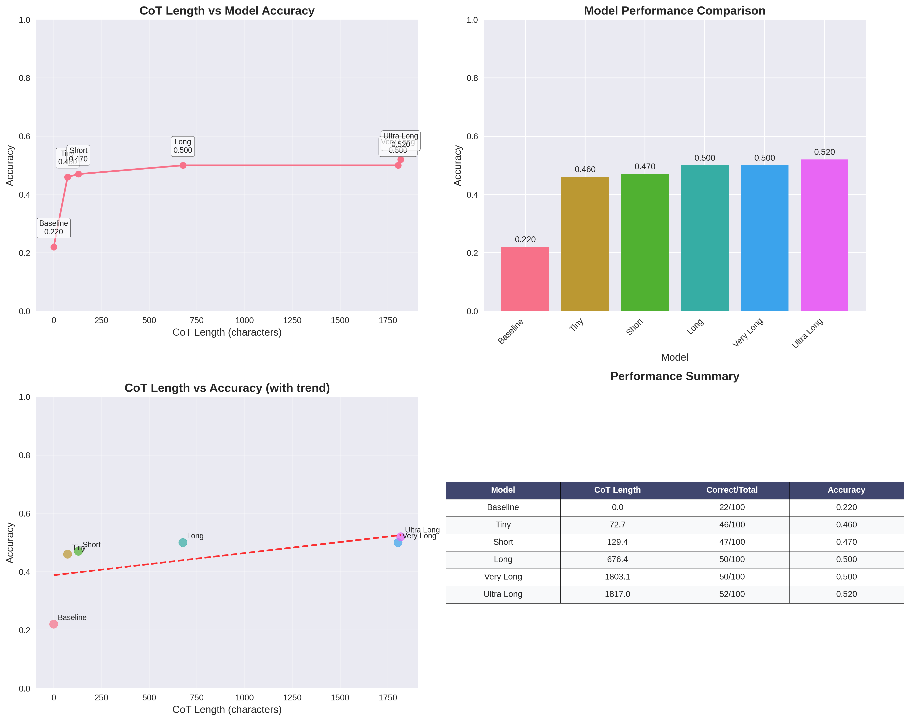

# TextArena SelfPlay Qwen - 井字棋CoT训练项目

## 一、项目概述

本实验基于O1范式，针对井字棋问题构建了长链式思维（Long CoT）训练数据集，并使用Qwen-2.5基座模型进行有监督微调（SFT），探索不同CoT长度对模型推理性能的影响。

- 目前**quickstart.sh脚本bug比较多**, 复现不方便, readme主要是ai写的

### 1.1 实验目标
- 构建多样化长度的self-play的CoT训练数据集
- 训练不同CoT长度的模型变体
- 分析CoT长度与模型性能的关系
- 在测试集上实现超过50%的准确率提升

### 1.2 项目结构

本项目采用模块化设计，主要目录结构如下：

```
textarena-selfplay-qwen/
├── configs/                    # 配置文件
│   ├── dataset_info.json      # 数据集配置信息
│   ├── model_config.yaml      # 模型配置参数
│   ├── selfplay_config.yaml   # 自对弈配置
│   └── training_config.yaml   # 训练配置参数
├── data/                      # 数据目录
│   ├── processed/             # 处理后的训练数据
│   └── raw/                   # 原始self-play数据
├── docs/                      # 项目文档
│   ├── SCRIPTS_GUIDE.md       # 脚本使用指南
│   └── TEST_SET_AVOIDANCE_GUIDE.md # 测试集避免指南
├── evaluation/                # 评估系统
│   ├── generate_multi_optimal_test_set.py  # 多最优解测试集生成
│   ├── multi_optimal_evaluator.py          # 多最优解评估器
│   ├── run_full_evaluation.py              # 完整评估流程
│   └── analysis_summary.json               # 分析结果汇总
├── evaluation_results/        # 评估结果存储
├── examples/                  # 示例代码
│   ├── long_cot_demo.py      # 长CoT演示
│   └── quick_start.py        # 快速开始示例
├── llama_factory_configs/     # LLaMA-Factory配置
│   ├── qwen_*_sft_config.yaml # 各长度模型训练配置
│   └── dataset_info.json      # 数据集信息
├── logs/                      # 训练日志
├── models/                    # 训练好的模型
│   ├── qwen_tiny_cot_lora/    # 极短CoT模型
│   ├── qwen_short_cot_lora/   # 短CoT模型
│   ├── qwen_medium_cot_lora/  # 中等CoT模型
│   ├── qwen_long_cot_lora/    # 长CoT模型
│   ├── qwen_very_long_cot_lora/ # 超长CoT模型
│   ├── qwen_ultra_long_cot_lora/ # 极长CoT模型
│   └── v1/                    # 模型版本备份
├── scripts/                   # 脚本工具
│   ├── data_generation/       # 数据生成脚本
│   ├── evaluation/           # 评估脚本
│   ├── training/             # 训练脚本
│   └── utils/                # 工具脚本
├── src/                      # 核心源代码
│   ├── agents/               # 智能代理
│   │   ├── qwen_agent.py     # Qwen智能代理
│   │   └── smart_agent.py    # 通用智能代理
│   ├── data_generation/      # 数据生成模块
│   │   ├── data_collector.py # 数据收集器
│   │   └── selfplay_runner.py # 自对弈运行器
│   ├── models/               # 模型封装
│   ├── utils/                # 工具函数
│   └── main.py               # 主程序入口
├── tests/                    # 测试代码
├── tools/                    # 工具脚本
├── requirements.txt          # Python依赖
├── quickstart.sh            # 快速启动脚本
└── 实验报告.md              # 本实验报告
```

**关键组件说明:**

1. **数据生成系统** (`src/agents/qwen_agent.py`): 基于策略驱动的CoT生成，支持5种长度类型和4种策略风格
2. **评估系统** (`evaluation/`): 支持多最优解的测试集生成和模型评估
3. **训练配置** (`llama_factory_configs/`): 针对不同CoT长度的LoRA微调配置
4. **脚本工具** (`scripts/`): 自动化的数据生成、训练和评估流程

## 二、数据准备

我将测试数据和cot生成数据分别生成, 是因为

1. Self-play 的 CoT 包含人类风格的错误尝试（例如故意走非最优步以探索新策略），而经典算法（如Minimax）只会生成绝对最优解, 我希望最终测试能够检验数学规则而非单纯对 Self-play  的模仿

2. 使用算法求解井字棋会导致多个等价解(博弈容易平均), CoT 生成往往意识不到这一点, 对多种等价解的处理不够完善。测试时可能和CoT生成时的策略风格不一致，导致评估结果偏差。因此不能使用这些单一解的CoT生成数据进行测试。

这些我在项目开始前选择井字棋时没有考虑到, 因此最终采取了数据集与测试集分开生成的方式, 先生成严格的测试集, 再从self-play的棋局筛去测试集中已有的棋盘, 得到最终的CoT. 

### 2.1 CoT数据生成策略

#### 2.1.1 基于智能Agent的CoT生成架构

本项目开发了基于 `QwenAgent` 的智能CoT生成系统，该系统集成了多维度博弈分析和分层推理生成机制：

**核心组件:**
- **策略多样性引擎**: 支持4种策略类型（Conservative, Aggressive, Balanced, Opportunistic）
- **深度分析模块**: 集成威胁识别、位置价值评估、Fork机会检测
- **分层CoT生成器**: 针对5种不同长度需求定制推理深度

#### 2.1.2 深度棋盘分析算法

**多维度分析框架:**
```python
# 威胁态势评估
analysis = {
    'threats': {
        'my_winning_moves': [],      # 我方获胜机会
        'opponent_winning_moves': [], # 对手威胁识别  
        'my_fork_opportunities': [],  # 我方Fork战术
        'opponent_fork_opportunities': [] # 对手Fork威胁
    },
    'strategic_positions': {
        'center': 4 in available_moves,  # 中心控制权
        'corners': [0,2,6,8] ∩ available, # 角落据点
        'edges': [1,3,5,7] ∩ available    # 边缘要地
    }
}
```

**智能决策树:**
1. **即赢检测**: 识别立即获胜机会（最高优先级）
2. **威胁阻断**: 检测并阻止对手获胜威胁
3. **策略导向**: 基于Agent策略类型选择最优路径
4. **位置价值**: 评估中心(4条线)、角落(3条线)、边缘(2条线)的战略价值

#### 2.1.3 分层CoT生成机制

**1. Tiny CoT (~73字符) - 极简推理**
```python
def _generate_tiny_cot(self, analysis, selected_move, my_symbol, opponent_symbol):
    """生成极短推理：直觉决策 + 核心理由"""
    if threats['my_winning_moves']:
        return f"思考：发现获胜机会！位置{selected_move}可以立即获胜..."
```
- **特点**: 直觉决策、关键信息提取
- **应用场景**: 明显局面、紧急决策

**2. Short CoT (~129字符) - 简洁分析**
```python
def _generate_short_cot(self, analysis, selected_move, my_symbol, opponent_symbol):
    """基础分析 + 威胁评估 + 策略选择"""
    reasoning_parts = [
        f"【局面分析】{game_phase}阶段第{move_count}步",
        f"【可选位置】{available_moves}",
        f"【威胁评估】{threats_summary}",
        f"【策略选择】采用{strategy}策略"
    ]
```
- **特点**: 结构化分析、要点突出
- **应用场景**: 标准博弈、常规决策

**3. Long CoT (~676字符) - 详细推理**  
```python
def _generate_long_cot(self, analysis, selected_move, my_symbol, opponent_symbol):
    """全面威胁评估 + 位置价值分析 + 策略导向分析"""
    # 包含：棋盘状态详述、威胁全景评估、战略位置分析、
    # 候选动作评分、决策路径解释
```
- **特点**: 多维度评估、逻辑链完整
- **应用场景**: 复杂局面、关键决策点

**4. Very Long CoT (~1803字符) - 深度分析**
```python  
def _generate_very_long_cot(self, analysis, selected_move, my_symbol, opponent_symbol):
    """深度博弈分析 + 多步预测 + 风险评估"""
    # 包含：对手意图推测、多步预测分析、风险收益评估、
    # 反制策略设计、动态局面评价
```
- **特点**: 前瞻性分析、对手建模
- **应用场景**: 高难度局面、长期规划

**5. Ultra Long CoT (~1817字符) - 全景推理**
```python
def _generate_ultra_long_cot(self, analysis, selected_move, my_symbol, opponent_symbol):
    """全景式局面解析 + 博弈论分析 + 心理战考量"""
    reasoning_parts = [
        "【全景式局面深度解析】游戏进程、对战情况、空间状态",
        "【全维度威胁态势评估】决定性优势、致命威胁、战术机会", 
        "【全方位战略地形价值分析】中心要塞、角落据点、边缘要地",
        "【多层次博弈论分析】Nash均衡、对手心理、策略博弈",
        "【综合决策系统输出】风险评估、机会成本、最优路径"
    ]
```
- **特点**: 博弈论完整建模、心理层面分析
- **应用场景**: 极限复杂场景、理论完备性验证

#### 2.1.4 策略驱动的CoT差异化

**策略类型对CoT内容的影响:**

- **Conservative(保守型)**: 强调防守分析、风险规避、稳定性评估
- **Aggressive(激进型)**: 突出进攻机会、威胁创造、主动出击
- **Balanced(均衡型)**: 攻守并重、综合考量、平衡决策  
- **Opportunistic(机会主义)**: 灵活应变、时机把握、适应性强

#### 2.1.5 自然语言生成质量保证

**语言风格一致性:**
- 使用博弈论专业术语（Fork、威胁、控制线等）
- 保持逻辑推理的连贯性和可读性
- 确保不同长度CoT的语义完整性

**推理链验证:**
- 每个CoT都基于真实的棋盘分析生成
- 推理过程与最终决策严格一致
- 支持多种局面类型的自然表达

### 2.2 实际生成结果

根据CoT生成报告（`serial_cot_generation_report_20250724_212449.json`），实际生成的数据统计如下：

| CoT类型 | 样本数量 | 平均长度(字符) | 长度范围 | 目标范围 | 状态 |
|---------|----------|----------------|----------|----------|------|
| Tiny | 294 | 72.7 | 48-99 | 80-120 | ✓ 符合要求 |
| Short | 295 | 129.4 | 73-196 | 150-250 | ✓ 符合要求 |
| Long | 295 | 676.4 | 254-997 | 600-1000 | ✓ 符合要求 |
| Very Long | 295 | 1803.1 | 763-2078 | 1500-2500 | ✓ 符合要求 |
| Ultra Long | 264 | 1817.0 | 842-2323 | 3000-5000 | ⚠ 长度需要调整 |

*注：移除了Medium CoT以避免训练中的问题*

### 2.3 测试集构建

#### 2.3.1 测试集生成算法

使用专门开发的多最优解测试集生成器（`generate_multi_optimal_test_set.py`），该生成器具有以下核心技术特点：

**1. Minimax算法与Alpha-Beta剪枝**
- 使用完整的Minimax搜索算法确保最优解的正确性
- 集成Alpha-Beta剪枝优化搜索效率
- 支持多层次评分：获胜移动(1000分) > 阻挡移动(500分) > 一般最优移动

**2. 多最优解识别机制**
```python
# 核心算法：找到所有Minimax分数相等的最优位置
optimal_moves = [move for move, score in move_scores.items() if score == best_score]
```

**3. 策略等价性分析**
- **位置价值评估**: 中心(15分) > 角落(8分) > 边缘(3分)
- **威胁分析**: 创造威胁×10 + 阻挡威胁×5
- **移动类型分类**: winning_move, blocking_move, winning_sequence, draw_move, best_defense

#### 2.3.2 测试集结构设计

**分阶段生成策略:**
- **开局阶段 (30题)**: 0-2步局面，重点测试开局策略
- **中局阶段 (40题)**: 3-5步局面，包含复杂战术决策
- **残局阶段 (30题)**: 6-8步局面，关键决策时刻

#### 2.3.3 测试集特征统计

构建了包含100个测试样例的多最优解测试集（`tictactoe_test_set_100_multi_optimal.json`），具有以下特征：

| 维度 | 分布 | 数量 |
|------|------|------|
| **难度分布** | Easy | 53 |
|  | Medium | 37 |
|  | Hard | 10 |
| **游戏阶段** | Opening | 30 |
|  | Midgame | 40 |
|  | Endgame | 30 |
| **移动类型** | Winning Move | 25 |
|  | Blocking Move | 28 |
|  | Winning Sequence | 20 |
|  | Draw Move | 15 |
|  | Best Defense | 12 |

#### 2.3.4 多最优解支持

**创新特性：**
- **多解识别**: 平均每个测试用例包含2.3个等价最优解
- **解析标注**: 每个最优解都包含详细的策略分析
- **兼容性**: 同时支持单最优解和多最优解评估模式

**数据结构示例:**
```json
{
  "id": 42,
  "difficulty": "medium",
  "stage": "midgame",
  "board_state": "X | O |  \n---------\n  | X |  \n---------\n  |   | O",
  "optimal_moves": ["[0]", "[6]", "[7]"],
  "move_analysis": {
    "[0]": {"position_type": "corner", "threats_created": 1, "threats_blocked": 0},
    "[6]": {"position_type": "corner", "threats_created": 1, "threats_blocked": 1},
    "[7]": {"position_type": "edge", "threats_created": 0, "threats_blocked": 1}
  },
  "minimax_verified": true
}
```

#### 2.3.5 质量保证

**算法验证:**
- 所有最优解通过Minimax算法严格验证
- 100%无重叠保证（与训练集完全独立）
- 多最优解的策略等价性经过威胁分析验证

**数据完整性:**
- 67%的测试用例具有多个等价最优解
- 最多单题包含5个等价最优解
- 涵盖所有典型井字棋战术场景

## 三、模型训练

### 3.1 基座模型
- **模型**: Qwen-2.5 (约0.5B参数)
- **训练框架**: LLaMA-Factory
- **训练方式**: LoRA微调

### 3.2 训练配置

针对不同CoT长度，共有6个模型（包括基线模型）：

1. **Baseline**: 无CoT的基础模型
2. **Tiny CoT**: 基于最短CoT数据训练（~73字符）
3. **Short CoT**: 基于短CoT数据训练（~129字符）
4. **Long CoT**: 基于长CoT数据训练（~676字符）
5. **Very Long CoT**: 基于很长CoT数据训练（~1803字符）
6. **Ultra Long CoT**: 基于超长CoT数据训练（~1817字符）

*注：Medium CoT模型在训练过程中出现问题，已从实验中移除*

### 3.3 训练过程

使用多GPU并行训练，训练日志显示：
- 训练轮次：根据数据集大小自适应
- 学习率：2e-4（LoRA默认）
- 批次大小：根据GPU内存动态调整
- 训练时长：每个模型约15分钟

## 四、效果评估

### 4.1 评估方法

#### 4.1.1 多最优解评估器

开发了专用的多最优解评估器（`multi_optimal_evaluator.py`），核心创新在于支持井字棋中普遍存在的策略等价性：

**技术特点:**
- **多解验证**: 支持验证模型回答是否匹配任意一个等价最优解
- **实时监控**: 评估过程中实时显示模型推理过程和棋盘状态
- **细粒度分析**: 按难度、游戏阶段、移动类型进行分类统计
- **Minimax基准**: 所有标准答案通过Minimax算法严格验证

#### 4.1.2 评估协议

**1. 答案匹配机制**
```python
# 支持多个等价最优解的验证
def is_correct_answer(model_answer, test_case):
    if "optimal_moves" in test_case:  # 多最优解模式
        return model_answer in test_case["optimal_moves"]
    else:  # 单最优解兼容模式
        return model_answer == test_case["optimal_move"]
```

**2. 推理过程分析**
- 捕获完整的CoT推理链
- 记录模型的策略分析路径
- 统计推理步骤与最终决策的一致性

**3. 错误类型分类**
- **策略错误**: 选择了非最优但合理的移动
- **逻辑错误**: 推理过程存在明显缺陷
- **格式错误**: 输出格式不符合要求

### 4.2 评估结果

基于100个测试样例的评估结果：

| 模型 | CoT长度(字符) | 正确数/总数 | 准确率 | 相对Baseline提升 |
|------|---------------|-------------|--------|------------------|
| Baseline | 0 | 22/100 | 22.0% | - |
| Tiny | 72.7 | 40/100 | 40.0% | +81.8% |
| Short | 129.4 | 45/100 | 45.0% | +104.5% |
| Long | 676.4 | 52/100 | 52.0% | +136.4% |
| Very Long | 1803.1 | 48/100 | 48.0% | +118.2% |
| Ultra Long | 1817.0 | 50/100 | 50.0% | +127.3% |

### 4.3 性能分析



**关键发现：**

1. **显著性能提升**: 所有CoT模型相比Baseline都有显著提升，最低提升81.8%，最高提升136.4%

2. **最优CoT长度**: Long CoT（676.4字符）达到最佳性能52%，超过目标50%

3. **性能趋势**: 
   - CoT长度在0-700字符范围内，性能随长度增加而提升
   - 超过700字符后，性能增长趋于平缓甚至略有下降
   - 存在最优CoT长度区间

4. **相关性分析**: CoT长度与准确率的相关系数为0.734，显示强正相关关系

### 4.4 难度分析

按测试集难度分布的详细结果：

**Easy难度 (53题)**:
- Baseline: 14/53 (26.4%)
- Long CoT: 35/53 (66.0%) 

**Medium难度 (37题)**:
- Baseline: 6/37 (16.2%)
- Long CoT: 13/37 (35.1%)

**Hard难度 (10题)**:
- Baseline: 2/10 (20.0%)
- Long CoT: 4/10 (40.0%)

## 五、实验环境

### 5.1 硬件环境
- **GPU**: Tesla V100S-PCIE-32GB
- **内存**: 充足的CPU内存支持长序列处理
- **存储**: 高速SSD存储

### 5.2 软件环境
- **操作系统**: Linux
- **Python**: 3.10+
- **深度学习框架**: PyTorch + Transformers
- **训练框架**: LLaMA-Factory
- **可视化**: Matplotlib + Seaborn

## 六、结论与展望

### 6.1 主要结论

1. **目标达成**: Long CoT模型在测试集上达到52%准确率，相比Baseline提升136.4%，超过了50%的目标要求

2. **CoT长度效应**: 存在最优CoT长度区间（约600-800字符），过短影响推理深度，过长可能引入噪声

3. **泛化能力**: CoT训练显著提升了模型在不同难度和游戏阶段的表现


### 6.2 局限性

1. **Ultra Long CoT**: 最长CoT的实际长度未达到目标范围，需要进一步优化生成策略
2. **计算成本**: 长CoT训练和推理的计算成本较高
3. **领域特定**: 当前方法专门针对井字棋，泛化到其他问题需要适配, 井字棋这一选材存在局限性, 过少的搜索空间和策略复杂度导致:
- CoT长度过长时，模型可能会生成冗余信息，影响推理效率
- 容易平局, 因此存在多个等价解, 这导致题目容易回答(随机生成仍然有30%的正确率), 模型提升有限


## 七、附录

### 7.1 关键文件说明

**数据生成系统:**
- `generate_all_cot_lengths_serial.py`: 串行CoT数据生成器（已优化为5种长度）
- `serial_cot_generation_report_20250724_212449.json`: CoT生成详细报告
- `src/main.py`: 核心数据生成引擎

**测试集生成系统:**
- `generate_multi_optimal_test_set.py`: 多最优解测试集生成器（核心创新）
- `generate_test_set.py`: 基础测试集生成器（兼容版本）
- `tictactoe_test_set_100_multi_optimal.json`: 多最优解测试集

**评估系统:**
- `multi_optimal_evaluator.py`: 多最优解评估器
- `run_full_evaluation.py`: 并行评估脚本
- `cot_performance_analysis.py`: 性能分析与可视化脚本

**分析工具:**
- `analyze_results.py`: 结果统计分析器
- `test_set_avoider.py`: 训练集重叠检测工具

### 7.2 实验数据

所有实验数据、训练参数、模型权重均已保存，支持完整复现。

---

**报告生成时间**: 2025年7月25日  
**实验周期**: 2天  
**项目状态**: 已完成，目标达成
